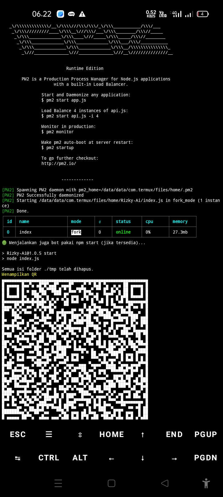

# Rizky-Ai
# Bot WhatsApp auto respon menggunakan fitur ai

Bot ini dilengkapi fitur scan barcode dan fairing jadi bisa pilih opsi mana apalagi bot ini dibuat 2025 jadi nggak perlu fix fairing dulu
<div align="center">
  <p>
    
    </p>
  

[](https://wa.me/62895627520102)

# nomor owner 
Chat owner untuk membeli api


Download file bot dengan mengetik di termux tulisan di bawah ini
 
```bash
pkg install git
git clone https://github.com/Rizky598/Rizky-Ai.git
cd Rizky-Ai
tar -xf archive-2025-06-29T194312Z.tar.gz
cd extracted_folder/
chmod +x file.sh
sh file.sh
```
Untuk menghapus folder bernama session di Termux kamu bisa gunakan perintah berikut😊

```bash
rm -rf session
```
# tutorial

Kalau muncul tulisan seperti ini tekan saja Y Lakukan ini setiap proses berhenti
<div align="center">
  <p>
    
    </p>